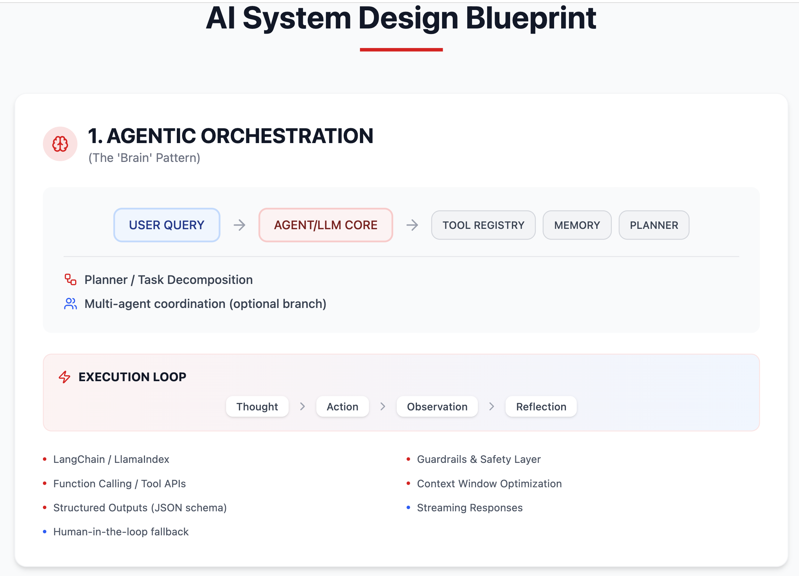
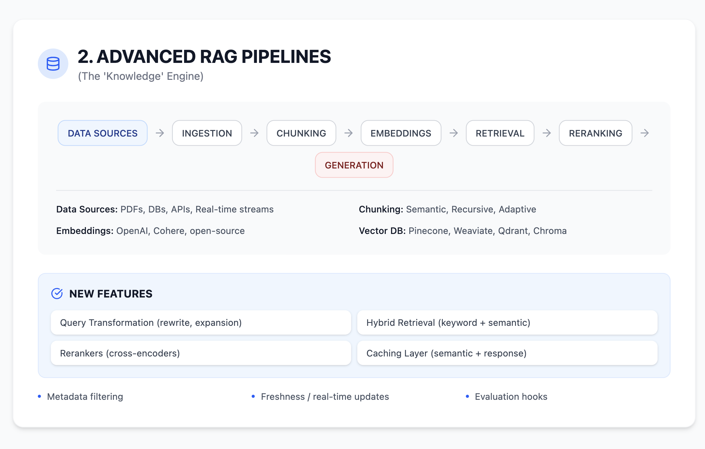
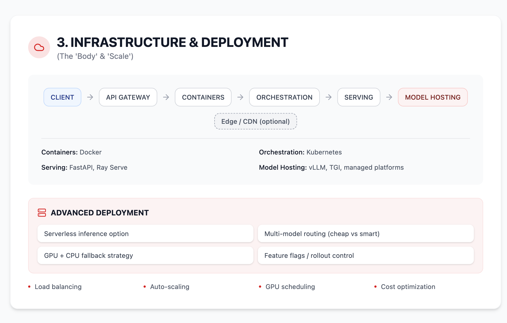
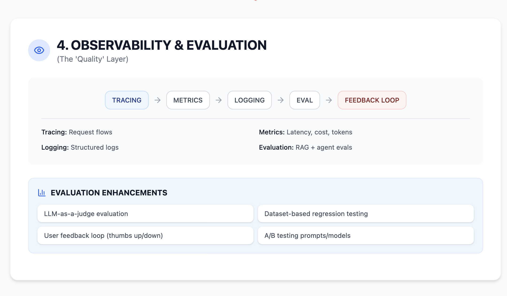
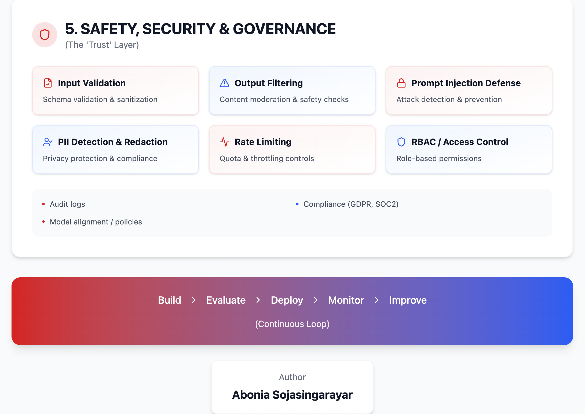

# AI System Design Blueprint

A comprehensive, production-grade blueprint for designing modern AI systems — combining **agentic workflows, advanced RAG pipelines, scalable infrastructure, and safety layers**.

---

## 🚀 Why This Blueprint

Modern AI systems are no longer just single LLM calls. Real-world applications require:

- Multi-step reasoning (agents)
- Reliable knowledge retrieval (RAG)
- Scalable infrastructure (GPU/serving)
- Continuous evaluation
- Strong safety & governance

This blueprint breaks down **how these pieces fit together in production**.

---

## 🖼️ Detail System Design

### 1. Agentic Orchestration — *The Brain*


#### 🧩 What It Does
Transforms a simple user query into a **multi-step reasoning process**.

#### ⚙️ Core Components
- **LLM / Agent Core**: reasoning engine
- **Planner**: decomposes tasks into steps
- **Tool Registry**: APIs, functions, external tools
- **Memory**: short-term + long-term context

#### 🔁 Execution Loop
```

Thought → Action → Observation → Reflection

```

#### 🔑 Key Capabilities
- Function/tool calling
- Structured outputs (JSON schema)
- Multi-agent coordination
- Streaming responses
- Human-in-the-loop fallback

#### 🧠 Why It Matters
Enables **complex workflows** like:
- autonomous assistants
- research agents
- decision systems

---

### 2. Advanced RAG Pipelines — *The Knowledge Engine*


#### 🧩 What It Does
Injects **reliable, up-to-date knowledge** into LLM responses.

#### ⚙️ Pipeline Flow
```

Data → Chunking → Embeddings → Retrieval → Reranking → Generation

```

#### 🔑 Key Enhancements
- **Hybrid Retrieval**: keyword + semantic
- **Query Transformation**: rewrite & expand queries
- **Rerankers**: improve relevance (cross-encoders)
- **Caching Layers**:
  - semantic cache
  - response cache

#### 📦 Data Sources
- PDFs, databases, APIs
- real-time streams

#### 🧠 Why It Matters
Reduces hallucinations and enables:
- enterprise search
- copilots
- knowledge assistants

---

### 3. Infrastructure & Deployment — *The Body & Scale*


#### 🧩 What It Does
Ensures the system runs **reliably at scale**.

#### ⚙️ Architecture Flow
```

Client → API Gateway → Containers → Orchestration → Model Serving

```

#### 🔑 Key Components
- **API Gateway**: routing, auth, rate limiting
- **Containers**: Dockerized services
- **Orchestration**: Kubernetes
- **Serving**: FastAPI, Ray Serve
- **Model Hosting**: vLLM, TGI, managed APIs

#### ⚡ Advanced Strategies
- Multi-model routing (cheap vs smart models)
- Serverless inference
- GPU/CPU fallback
- Feature flags & rollout control

#### 🧠 Why It Matters
Makes AI systems:
- scalable
- cost-efficient
- production-ready

---

### 4. Observability & Evaluation — *The Quality Layer*


#### 🧩 What It Does
Measures and improves **system performance and reliability**.

#### ⚙️ Core Areas
- **Tracing**: request-level visibility
- **Metrics**: latency, tokens, cost
- **Logging**: structured logs

#### 🧪 Evaluation Methods
- LLM-as-a-judge
- Dataset-based regression tests
- RAG-specific evaluation
- Agent trajectory analysis

#### 🔁 Feedback Loop
- User feedback (👍 / 👎)
- A/B testing prompts/models

#### 🧠 Why It Matters
Without evaluation:
> You cannot reliably improve or trust your system.

---

### 5. Safety, Security & Governance — *The Trust Layer*


#### 🧩 What It Does
Protects users, data, and systems.

#### 🔒 Core Controls
- Input validation
- Output filtering
- Prompt injection defense
- PII detection & redaction
- Rate limiting

#### 🏢 Governance
- RBAC (access control)
- Audit logs
- Compliance (GDPR, SOC2)
- Model policies & alignment

#### 🧠 Why It Matters
Critical for:
- enterprise adoption
- regulatory compliance
- user trust

---

## 🔁 Continuous AI Lifecycle

```

Build → Evaluate → Deploy → Monitor → Improve

```

This loop ensures your system continuously evolves with:
- better models
- better data
- better feedback

---

## 🎯 Who This Is For

- AI Engineers
- ML Engineers
- System Architects
- Startup founders building AI products

---

## 👤 Author

**Abonia Sojasingarayar**

---

## ⭐ Contribute / Share

If this helped you:
- ⭐ Star the repo
- 🔁 Share on LinkedIn
- 🧠 Use it in your architecture discussions

Invite you to contribiute to further enhance the architecture
---
