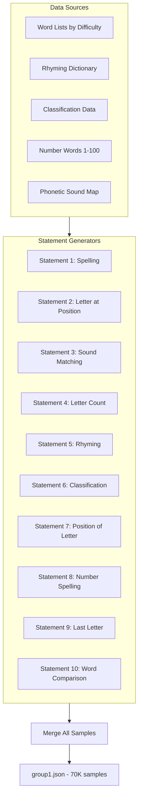

# Group 1 Language and Literacy Dataset Generation (70,000 Samples)

## Output Format
Simple key-value JSON format in `curriculum_training_data/group1.json`:
```json
{
  "What is the spelling of 'cat'?": "c, a, t",
  "Spell 'dog'": "d, o, g",
  ...
}
```

## Architecture



## Statement Breakdown (10 generators)

### Statement 1: Spelling (10,000 samples)
- **Semantic variations**: 12 templates including "Spell X", "What is the spelling of X?", "What are the letters in X?", "Write the spelling of X", "How do you spell X?", "Give me the spelling of X", "Tell me the spelling of X", "What is X spelled as?", "Can you spell X?", "What's the spelling of X?", "Spell out X", "What does X spell?"
- **Word pool**: 7,031 unique words total (EASY: 1,077, MEDIUM: 3,006, HARD: 4,138)
- **Max capacity**: ~84,000 combinations (7,031 words × 12 templates)
- **Generation strategy**: Random selection with high max_attempts (50×)
- **Difficulty**: 30% easy (3-4 letters), 50% medium (5-6 letters), 20% hard (7-9 letters)
- **Answer format**: Comma-separated letters (e.g., "c, a, t")

### Statement 2: Letter at Position (9,000 samples)
- **Semantic variations**: 4 templates including "Can you say the {position} letter in X?", "Tell me the {position} letter of X", "Give me the {position} letter of X", "What is the {position} letter in X?"
- **Position formats**: Word form ("first", "second", "third") and numeric ("1st", "2nd", "3rd", or plain "1", "2", "3")
- **Word pool**: All words from EASY + MEDIUM + HARD pools (7,031 unique words)
- **Max capacity**: ~140,000+ combinations (words × positions × 4 templates)
- **Generation strategy**: Random selection with high max_attempts (200×)
- **Difficulty**: 30% easy (positions 1-2), 50% medium (middle positions), 20% hard (later positions)

### Statement 3: Sound Matching (7,000 samples)
- **Semantic variations**: 2 templates - "Which word starts with the sound X, A or B?", "Pick the word that begins with sound X: A or B"
- **Phonetic sounds**: /b/, /k/, /d/, /f/, /g/, /h/, /j/, /l/, /m/, /n/, /p/, /r/, /s/, /t/, /v/, /w/, /z/, plus complex sounds (/ch/, /sh/, /th/, /ph/)
- **Phonetic sound mappings**: 167 words mapped to their starting sounds
- **Max capacity**: ~50,000+ combinations (sound pairs × 2 templates)
- **Generation strategy**: Random selection with max_attempts (50×)
- **Difficulty**: 40% easy (common consonants), 40% medium (vowel sounds), 20% hard (complex sounds)
- **Handle phonetic nuances**: "c" can be /k/ (cat) or /s/ (city), "ph" = /f/

### Statement 4: Letter Count (9,000 samples)
- **Semantic variations**: 8 templates including "How many alphabets are there in X?", "Count the letters in X", "Letter count of X", "How many letters are in X?", "What is the length of word X?", "How many letters does X have?", "Count the number of letters in X", "What's the letter count of X?"
- **Word pool**: All words from EASY + MEDIUM + HARD pools (7,031 unique words)
- **Max capacity**: ~56,000 combinations (7,031 words × 8 templates)
- **Generation strategy**: Random selection with max_attempts (150×)
- **Difficulty**: 30% easy (3-4 letters), 50% medium (5-6 letters), 20% hard (7-9 letters)
- **Answer format**: Numeric string (e.g., "3", "8")

### Statement 5: Rhyming (7,000 samples)
- **Semantic variations**: 24 templates including "What word rhymes with X?", "Tell me a word that rhymes with X", "Give me a rhyming word for X", "Find a rhyme for X", "What rhymes with X?", "Can you give me a word that rhymes with X?", "Name a word that rhymes with X", "Say a word that rhymes with X", "Think of a word that rhymes with X", "Provide a rhyming word for X", "Which word rhymes with X?", "What is a word that rhymes with X?", "Give me a rhyme for X", "Find a word that sounds like X", "What sounds like X?", "Tell me something that rhymes with X", "Can you think of a rhyme for X?", "Share a word that rhymes with X", "Suggest a word that rhymes with X", "What's a rhyming word for X?", "Give a word that ends like X", "Find me a rhyme for X", "State a word that rhymes with X", "Mention a word that rhymes with X"
- **Rhyming dictionary**: 
  - Base RHYMING_DICT with bidirectional mappings
  - 42 common ending groups (at, og, un, ed, en, ake, ight, ain, all, ell, ip, op, ug, an, in, ot, ar, ay, ee, ow, ock, ick, ack, ink, ank, ing, ump, ash, ush, est, ust, and, end, old, ore, ine, ame, ate, ice, ace, ose, ound)
  - **454 unique rhyming words** total
- **Max capacity**: ~10,900 combinations (454 words × 24 templates)
- **Generation strategy**: **Systematic approach** - enumerate all (word × template) combinations, shuffle, then select (ensures all combinations explored efficiently)
- **Difficulty**: 40% easy (1 syllable), 40% medium (2 syllables), 20% hard (3+ syllables)

### Statement 6: Classification (7,000 samples)
- **Semantic variations**: 20 templates including "Is X a person, animal, or thing?", "Classify X as person, animal, or thing", "What is X - a person, animal, or thing?", "Tell me if X is a person, animal, or thing", "Is X a person, an animal, or a thing?", "What category is X - person, animal, or thing?", "Does X belong to person, animal, or thing category?", "Which category does X fall under: person, animal, or thing?", "Categorize X: is it a person, animal, or thing?", "Would you classify X as a person, animal, or thing?", "In which category would you place X: person, animal, or thing?", "Is the word X referring to a person, animal, or thing?", "Tell me the category of X: person, animal, or thing", "What type is X - person, animal, or thing?", "Identify X as person, animal, or thing", "Sort X into: person, animal, or thing", "X - is it a person, animal, or thing?", "Person, animal, or thing - which one is X?", "How would you categorize X: person, animal, or thing?", "Place X in the correct category: person, animal, or thing"
- **Category data**:
  - **Animals: 199 unique** (cat, dog, elephant, tiger, fish, bird, whale, eagle, shark, zebra, panda, koala, rabbit, monkey, donkey, turtle, dolphin, penguin, giraffe, butterfly, dragonfly, caterpillar, grasshopper, ladybug, firefly, crocodile, alligator, hippopotamus, rhinoceros, kangaroo, octopus, chicken, rooster, turkey, goose, swan, parrot, crow, sparrow, robin, squirrel, chipmunk, raccoon, skunk, opossum, beaver, otter, mink, wolf, coyote, jackal, hyena, cheetah, leopard, jaguar, lynx, buffalo, bison, elk, moose, caribou, reindeer, antelope, gazelle, camel, llama, alpaca, yak, ox, bull, calf, snake, lizard, gecko, iguana, chameleon, tortoise, terrapin, frog, toad, salamander, newt, tadpole, spider, scorpion, crab, lobster, shrimp, prawn, crayfish, jellyfish, starfish, seahorse, stingray, eel, salmon, tuna, trout, worm, snail, slug, beetle, moth, wasp, hornet, fly, gnat, mosquito, finch, canary, dove, pigeon, pelican, flamingo, heron, stork, crane, vulture, falcon, osprey, egret, seagull, albatross, toucan, woodpecker, peacock, pheasant, quail, partridge, magpie, jay, cardinal, bluebird, hamster, gerbil, guinea, ferret, hedgehog, porcupine, badger, weasel, mongoose, meerkat, lemur, gibbon, orangutan, gorilla, chimpanzee, baboon, panther, cougar, puma, bobcat, ocelot, serval, caracal, wildcat, walrus, manatee, dugong, narwhal, beluga, porpoise, orca, python, cobra, viper, rattlesnake, anaconda, boa, mamba, croaker, cod, bass, perch, pike, carp, catfish, mackerel, herring)
  - **Things/Objects: 253 unique** (book, pen, desk, chair, table, lamp, sofa, phone, watch, clock, laptop, computer, keyboard, monitor, speaker, headphone, camera, window, mirror, bottle, guitar, pencil, notebook, backpack, door, car, bus, van, train, plane, truck, bike, house, bridge, tree, flower, plant, grass, stone, water, cloud, sun, moon, star, room, kitchen, bedroom, bathroom, garden, school, office, store, hospital, restaurant, library, museum, theater, airport, station, apple, banana, orange, grape, bread, milk, juice, coffee, tea, cake, chocolate, sandwich, hamburger, spaghetti, shirt, pants, shoes, socks, jacket, dress, skirt, gloves, scarf, cup, plate, bowl, fork, knife, spoon, pot, pan, kettle, mug, basket, box, bag, suitcase, wallet, purse, umbrella, hat, cap, belt, tie, ring, necklace, bracelet, earring, glasses, sunglasses, pillow, blanket, sheet, towel, soap, shampoo, toothbrush, toothpaste, brush, comb, tissue, paper, envelope, stamp, letter, package, ball, toy, doll, puzzle, game, card, dice, chess, checkers, bicycle, scooter, skateboard, helmet, building, tower, wall, fence, gate, path, road, street, sidewalk, park, playground, bench, fountain, statue, monument, sign, post, hammer, nail, screw, drill, saw, wrench, pliers, screwdriver, tape, glue, paint, brush, ladder, rope, chain, wire, cable, pipe, hose, bucket, broom, mop, vacuum, dustpan, sponge, cloth, rag, detergent, candle, match, lighter, flashlight, battery, charger, adapter, plug, shelf, drawer, cabinet, closet, wardrobe, dresser, nightstand, bookcase, rug, carpet, curtain, blind, shade, mat, doormat, welcome, frame, vase, pot, planter, tray, coaster, napkin, tablecloth, centerpiece, radio, television, remote, antenna, satellite, microphone, amplifier, piano, violin, drum, flute, trumpet, saxophone, clarinet, harp, medal, trophy, award, certificate, diploma, ribbon, badge, pin, coin, bill, credit, debit, check, receipt, invoice, ticket, map, compass, globe, atlas, dictionary, encyclopedia, magazine, newspaper)
  - **Persons: 170 unique** (teacher, doctor, nurse, farmer, artist, writer, singer, dancer, actor, mother, father, sister, brother, uncle, aunt, cousin, friend, child, student, pilot, chef, engineer, scientist, lawyer, judge, police, soldier, firefighter, builder, driver, waiter, manager, director, president, mayor, coach, athlete, musician, painter, sculptor, photographer, journalist, dentist, veterinarian, mechanic, barber, carpenter, plumber, electrician, gardener, baker, cook, server, cashier, clerk, secretary, assistant, principal, professor, researcher, analyst, designer, architect, consultant, supervisor, executive, officer, captain, sergeant, detective, guard, nanny, babysitter, tutor, instructor, trainer, mentor, counselor, grandmother, grandfather, grandson, granddaughter, niece, nephew, librarian, pharmacist, accountant, banker, realtor, salesperson, broker, editor, publisher, translator, interpreter, reporter, anchor, host, comedian, magician, clown, acrobat, juggler, stuntman, model, tailor, seamstress, weaver, potter, blacksmith, jeweler, watchmaker, butcher, fisherman, hunter, rancher, cowboy, shepherd, beekeeper, lifeguard, paramedic, surgeon, therapist, psychologist, psychiatrist, optometrist, chiropractor, radiologist, anesthesiologist, pediatrician, astronaut, geologist, biologist, chemist, physicist, mathematician, programmer, developer, tester, administrator, technician, specialist, receptionist, dispatcher, coordinator, planner, organizer, facilitator, ambassador, diplomat, governor, senator, representative, commissioner, husband, wife, spouse, partner, fiance, fiancee, widow, widower, infant, toddler, teenager, adult, senior, elder, youth, minor)
  - **Total: 622 unique classified words**
- **Max capacity**: ~12,400 combinations (622 words × 20 templates)
- **Generation strategy**: **Systematic approach** - enumerate all (word × template) combinations, shuffle, then select
- **Difficulty**: 40% easy, 40% medium, 20% hard (edge cases like "robot")

### Statement 7: Position of Letter (6,000 samples)
- **Semantic variations**: 8 templates total
  - First occurrence (5 templates): "At what location does letter X come in Y?", "Where is the letter X in Y?", "What position is X in Y?", "Find the position of letter X in Y", "What is the first position of X in Y?"
  - All positions (3 templates): "At what positions does X appear in Y?", "Find all positions of letter X in Y", "What are the positions of X in Y?"
- **Word pool**: All words from ALL_WORDS (7,031 unique words)
- **Max capacity**: ~280,000+ combinations (words × letters × 8 templates)
- **Generation strategy**: Random selection with max_attempts (200×), 70% first occurrence, 30% all positions
- **Handle multiple occurrences**: 
  - Some questions ask for first occurrence: "What is the first position of 'a' in 'banana'?" → "2"
  - Some questions ask for all positions: "At what positions does 'a' appear in 'banana'?" → "2, 4, 6"
- **Answer format**: Numeric string ("2" or "2, 4, 6")
- **Difficulty**: 30% easy, 50% medium, 20% hard (multiple occurrences)

### Statement 8: Number Spelling (3,500 samples)
- **Semantic variations**: 18 templates including "What is the spelling of X?", "Spell X", "How do you spell X?", "Write the spelling of X", "What's the spelling of X?", "Can you spell X?", "Give me the spelling of X", "Tell me the spelling of X", "What is X spelled as?", "Spell out X", "What does X spell?", "Provide the spelling of X", "How is X spelled?", "Write out X in letters", "What are the letters in X?", "Show me how to spell X", "Give the letters for X", "Break down the spelling of X"
- **Number range**: 1-100 (all numbers covered)
- **Question formats**: Numeric form ("11") and word form ("eleven") - randomly selected
- **Max capacity**: 3,600 combinations (100 numbers × 2 forms × 18 templates) - **tight but sufficient**
- **Generation strategy**: **Systematic approach** - enumerate all (number × form × template) combinations, shuffle, then select (ensures all combinations explored efficiently)
- **Answer format**: Comma-separated letters (e.g., "e, l, e, v, e, n")

### Statement 9: Last Letter (6,000 samples)
- **Semantic variations**: 7 templates including "What letter does X end with?", "What is the last letter of X?", "Which letter does X end with?", "Tell me the ending letter of X", "Find the final letter in X", "What's the last letter of X?", "Which letter comes at the end of X?"
- **Word pool**: All words from EASY + MEDIUM + HARD pools (7,031 unique words)
- **Max capacity**: ~49,000 combinations (7,031 words × 7 templates)
- **Generation strategy**: Random selection with max_attempts (150×)
- **Difficulty**: 30% easy (3-4 letters), 50% medium (5-6 letters), 20% hard (7-9 letters)
- **Answer format**: Single lowercase letter (e.g., "t")

### Statement 10: Word Comparison (5,500 samples)
- **Semantic variations**: 5 templates including "Which word is longer, X or Y?", "Is X longer than Y?", "Compare the length of X and Y", "Which is the longer word: X or Y?", "Tell me which word has more letters, X or Y"
- **Word pool**: All words from ALL_WORDS (7,031 unique words)
- **Max capacity**: ~250,000+ combinations (word pairs × 5 templates)
- **Generation strategy**: Random selection with max_attempts (100×)
- **Word pairs**: 
  - 30% obvious differences (3+ letter difference: EASY vs HARD words)
  - 50% moderate differences (1-2 letter difference: MEDIUM vs MEDIUM/HARD words)
  - 20% equal length (answer: "equal" or "both are equal" or "they are equal")
- **Answer**: The longer word, or "equal"/"both are equal"/"they are equal" for same length

## Implementation Structure

Create a single Python script `generate_group1_dataset.py` with:
1. **Data modules**: Word lists, rhyming dictionary, classification data, phonetic mappings, number words
2. **10 generator functions**: One per statement type
3. **Difficulty distribution**: Each generator respects the specified difficulty ratios
4. **Deduplication**: Ensure no duplicate queries (using dictionary keys)
5. **Generation strategies**:
   - **Random selection** (S1, S2, S3, S4, S7, S9, S10): Use high max_attempts multipliers (50× to 200×) to ensure enough unique samples
   - **Systematic enumeration** (S5, S6, S8): For generators with limited capacity, enumerate all (word × template) combinations, shuffle, then select. This ensures all combinations are explored efficiently without wasting attempts.
6. **Validation**: Built-in `validate_distribution()` function that categorizes queries using pattern matching and reports actual vs expected counts

## Files to Create/Modify
- `generate_group1_dataset.py` - Main generation script
- `curriculum_training_data/group1.json` - Output file (70,000 key-value pairs)

## Validation Checks
- Total samples = 70,000
- No duplicate queries (enforced by dictionary key uniqueness)
- All answers are programmatically verified
- Difficulty distribution matches requirements
- Word lengths within specified ranges
- Built-in validation function categorizes queries and reports distribution

## Key Learnings & Best Practices

### Word Pool Sizing
- **EASY_WORDS**: 1,077 unique words (3-4 letters)
- **MEDIUM_WORDS**: 3,006 unique words (5-6 letters)
- **HARD_WORDS**: 4,138 unique words (7-9+ letters)
- **Total unique words**: 7,031 words
- **Rule of thumb**: Need at least `target_samples / template_count` unique words per generator

### Template Counts
- More templates = more unique query variations
- Minimum templates needed: `target_samples / unique_words`
- Examples:
  - S5 (Rhyming): 7,000 samples / 454 words = ~15 templates minimum → used 24 templates ✓
  - S6 (Classification): 7,000 samples / 622 words = ~11 templates minimum → used 20 templates ✓
  - S8 (Number Spelling): 3,500 samples / 200 combinations = ~18 templates → used 18 templates ✓

### Generation Strategy Selection
- **Use systematic enumeration when**: `max_capacity < target_samples * 2` (tight capacity)
  - Examples: S5 (10,900 max), S6 (12,400 max), S8 (3,600 max)
- **Use random selection when**: `max_capacity >> target_samples` (plenty of capacity)
  - Examples: S1 (84,000 max), S2 (140,000+ max), S4 (56,000 max), S7 (280,000+ max), S9 (49,000 max), S10 (250,000+ max)

### Validation Pattern Matching
- Order matters: Check most specific patterns first
- Use substring matching: `"rhym" in query` catches both "rhyme" and "rhyming"
- Handle edge cases: Plain numbers ("5 letter") vs ordinals ("fifth letter") for S2
- Number detection: Check for both numeric digits and number words ("forty-two")

### Common Pitfalls to Avoid
1. **Insufficient word pools**: Leads to high duplication and under-generation
2. **Too few templates**: Limits unique query variations
3. **Random selection for tight capacity**: Wastes attempts, may not reach target
4. **Overlapping validation patterns**: Can cause miscategorization
5. **Missing template variations**: Some queries won't match validation patterns

## Capacity Analysis Summary

| Statement | Target | Templates | Unique Items | Max Capacity | Strategy | Status |
|-----------|--------|-----------|--------------|-------------|----------|--------|
| S1: Spelling | 10,000 | 12 | 7,031 words | ~84,000 | Random (50×) | ✅ OK |
| S2: Letter at Position | 9,000 | 4 | 7,031 words × positions | ~140,000+ | Random (200×) | ✅ OK |
| S3: Sound Matching | 7,000 | 2 | 167 sound mappings | ~50,000+ | Random (50×) | ✅ OK |
| S4: Letter Count | 9,000 | 8 | 7,031 words | ~56,000 | Random (150×) | ✅ OK |
| S5: Rhyming | 7,000 | 24 | 454 rhyming words | ~10,900 | **Systematic** | ✅ OK |
| S6: Classification | 7,000 | 20 | 622 classified words | ~12,400 | **Systematic** | ✅ OK |
| S7: Position of Letter | 6,000 | 8 | 7,031 words × letters | ~280,000+ | Random (200×) | ✅ OK |
| S8: Number Spelling | 3,500 | 18 | 100 numbers × 2 forms | 3,600 | **Systematic** | ✅ OK (tight) |
| S9: Last Letter | 6,000 | 7 | 7,031 words | ~49,000 | Random (150×) | ✅ OK |
| S10: Word Comparison | 5,500 | 5 | 7,031 word pairs | ~250,000+ | Random (100×) | ✅ OK |

**Total**: 70,000 samples successfully generated with proper distribution.

## Files Created
- `generate_group1_dataset.py` - Main generation script (2,089 lines)
- `curriculum_training_data/group1.json` - Output file (70,000 key-value pairs)
- `analyze_group1_queries.py` - Analysis script for distribution verification
