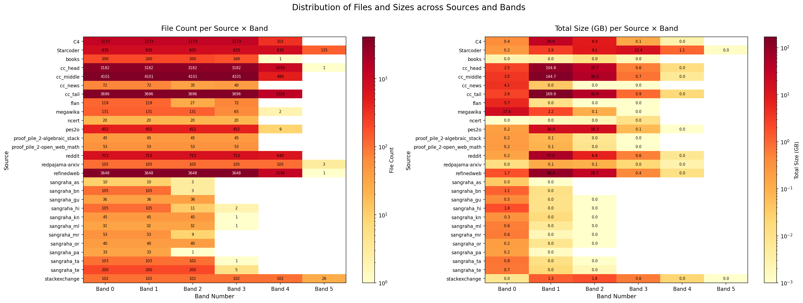
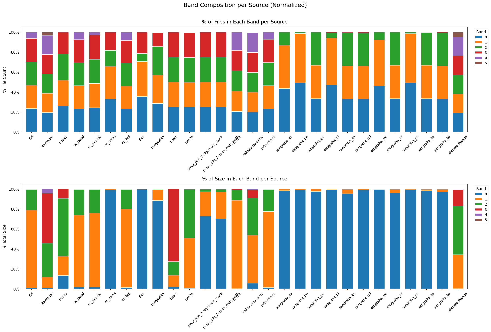
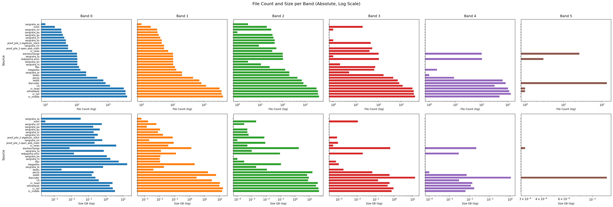
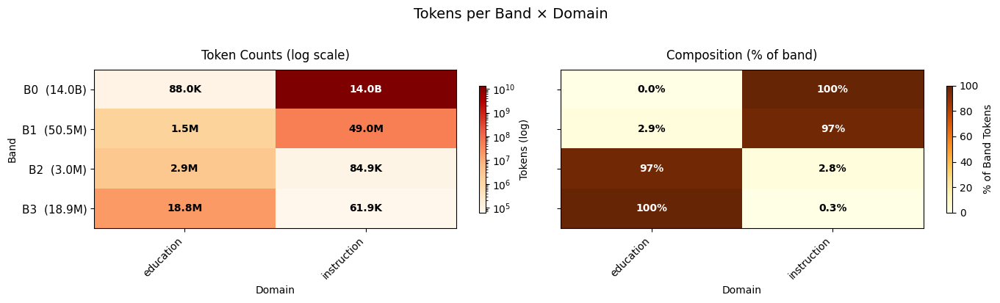

# T3 Coreset Engineering Report v2 — 2026-02-23

## Executive Summary

This report is generated by Team 3 Working Group on 22-Feb-2026 for coreset engineering delivery.

It documents how the pipeline works, what was evaluated in ablations,
determinism and reproducibility controls, and whether outputs meet the
charter and submission requirements defined in
`docs/REPORT_GENERATION_GUIDE.md`.

For this cycle, the data-processing scope was constrained by available EMR
capacity and source availability; accordingly, execution was limited to
`source=C4`, near-deduplication was excluded, and exact deduplication was
prioritized for operational feasibility. This decision is consistent with
publicly documented Dolma curation practices that describe the corpus as
curated, quality-filtered, and deduplicated for pretraining use
([Dolma paper, ACL 2024](https://arxiv.org/abs/2402.00159),
[AllenAI Dolma repository](https://github.com/allenai/dolma),
[OLMo model flow](https://allenai.org/olmo)).

## Source Scope Note

Team 2 provides data to Team 3 at record/document level. In the T3 flow, the
first job is T3 EMR, which performs **exact deduplication + chunk allocation +
stats generation**. The EC2 `coreset_builder.py` pipeline runs after these EMR
outputs are produced.

This report reflects runs executed only for `source=C4` through the above T3
EMR scope.

The corresponding EMR job was executed for a limited source subset, and C4 was
selected for this report because it is a large, cleaned Common Crawl-derived
web corpus with broad coverage, making it suitable for validating pipeline
behavior under realistic web-scale conditions.

## Known Constraints, Limitations, and Deferred Scope

- To stay within compute and storage limits, raw-text columns were removed from
  Team 2 outputs (or Team 3 inputs). With raw text retained, the dataset reached
  ~4 TB; exact deduplication was therefore executed on the reduced schema.
- Near-deduplication was not executed because it depends on raw text content;
  Team 1 guidance also indicated upstream Dolma slices are already substantially
  cleaned/deduplicated for most sources.
- In this run, T3 EMR deduplication is exact hash-based
  (`dropDuplicates(["hash"])`); no fuzzy/semantic near-dedup stage is used.
- The T3 EMR step performs chunk allocation on provided record/document inputs;
  it does not perform full raw-document chunk generation/re-chunking.
- FAISS/clustering-based subset processing was intentionally excluded because
  current data-volume and compute-capacity constraints made it operationally
  infeasible.
- Team 3 recieved data without token-level
  allocation and rejection summary tables needed for direct distribution
  analysis. To maintain execution momentum, Team 3 quickly integrated
  stats-level logic to derive per-band token signals after EMR dedup + chunk
  allocation. Final authoritative token-level rejection statistics remain an
  upstream dependency, so Team 3 currently derives additional accounting on total token calculations on the fly.
- In `coreset_builder.py`, the non-streaming stage loop is scoped to
  pretraining stages only (`1B`, `3B`, `8B`, `70B`); `SFT` and `ALIGNMENT`
  were out of scope for this report run.
- Operational reliability on EC2 Spot was a constraint during small-data
  validation: a ~10 GB run experienced at least 20 interruption/restart events
  and required nearly a full day due to spot termination behavior.
- End-to-end EMR execution across the full dataset scope for dedup + chunk
  allocation + stats was managed in phased steps. In this cycle,
  production-scale coreset outputs were not generated, and validated generation
  remained focused on `source=C4` pipeline testing.
- Implementation remained aligned with charter expectations through the Python
  processing stack used in this cycle.

### Current State and Challenges

- **Engineering readiness (strong):** the `coreset_builder` pipeline and
  end-to-end workflow are fully implemented in Python and compute-optimized via
  sharding for EC2-scale runtime. The design remains deterministic and
  trust-centric, with reproducible controls, manifest-based traceability, and
  auditable stage outputs.
- **Access enablement (in progress):** coordinate with AWS admin to provision
  and validate Team 3 access to required EMR and EC2 environments for dedup,
  chunk allocation, and stats workflows.
- **Data-contract and accounting risk (t3 scoped - in progress):** with ownership now centered
  in Team 3, token-level allocation and rejection summary tables are being
  restored/derived within the current workflow to publish complete
  upstream-to-downstream rejection accounting with stronger confidence.
- **Execution dependency (tracked):** full-scale execution currently depends on
  AWS admin support for cluster availability, permissions, and scheduling.
- **EMR run objective (next milestone):** execute dedup + chunk allocation +
  stats on ~2 TB input, with an expected runtime of ~4-5 hours and a target
  post-processing footprint of ~500 GB.
- **EC2 compute objective (next milestone):** provision on-demand EC2 capacity
  for ~12-14 hours to run end-to-end coreset generation reliably.
  - **Preferred EC2 profile A (CPU-optimized):** `c6i.32xlarge`
    (128 vCPU, 256 GiB RAM, Intel Ice Lake).
  - **Preferred EC2 profile B (memory-optimized):** `r6i.16xlarge`
    (64 vCPU, 512 GiB RAM, Intel Ice Lake).
  - **Storage requirement (to provision):** attach ~600 GB persistent EBS
    volume based on expected intermediate and output size after
    dedup/chunk-allocation reduction.

### Identified Filters

Team 3 and Team 2 collectively identified, refined, and implemented the
following filtering and gating mechanisms so that data not required for later
stages is stopped as early as possible at the T2 level itself.

| Stage | Mechanism | Condition / Threshold | Action | Notes |
| ------ | ----------- | ------------------------ | -------- | ------- |
| Preprocessing | Adaptive text sampling (`create_adaptive_sample`) | `<1K` chars: full text; `<10K`: 5K chars; `<50K`: 15K chars; `>=50K`: 25K chars | Builds `text_sample` used in downstream feature scoring | Reduces processing cost for long documents |
| Optional preprocessing | ArXiv cleaner (`clean_arxiv_optimized`) | Activated only for sources matching `arxiv` | Removes bibliography blocks, figure environments, selected LaTeX commands/citations | Present in script but commented out in main flow for this run |
| Stage 1 reject | Physical corruption guard | `byte_length < 50` | Reject (`is_rejected=True`, reason=`too_short_bytes`, level=`1`) | Basic malformed/empty-like record filter |
| Stage 1 reject | Short character guard | `char_length < 20` | Reject (reason=`too_short_chars`, level=`1`) | |
| Stage 1 reject | Short token guard | `token_count_estimate < 10` | Reject (reason=`too_short_tokens`, level=`1`) | |
| Stage 2 reject | Repetitive template detection | `unique_token_ratio < 0.01` and `word_count > 200` | Reject (reason=`repetitive_template`, level=`2`) | Detects low-diversity spam/template text |
| Stage 2 reject | Excessive whitespace detection | `whitespace_ratio > 0.95` | Reject (reason=`excessive_whitespace`, level=`2`) | |
| Stage 2 reject | Link spam detection | `url_ratio > 0.7` and `url_count > 50` | Reject (reason=`link_spam`, level=`2`) | |
| Stage 2 reject | Boilerplate spam detection | `boilerplate_ratio > 0.50` | Reject (reason=`boilerplate_spam`, level=`2`) | Boilerplate keywords include policy/ToS/subscription markers |
| Stage 2 reject | Thread-fragment detection | `thread_marker_count > 5` and `token_count_estimate < 200` | Reject (reason=`orphaned_thread_fragment`, level=`2`) | |
| Banding gate | Probabilistic curriculum banding (`assign_curriculum_bands_probabilistic`) | Gaussian-style weights around centers with `WIDTH=0.20`; final assignment uses minimum probability threshold `EPS=0.15` | Produces `band_p_B0..band_p_B5`; assigns `band`/`assigned_band` | Uses content-score nudges (`code_score`, `math_score`, `reasoning_score`, `cot_score`, `agentic_score`) |
| Output split | Acceptance/rejection branch | `is_rejected` boolean after Stage 1+2 | Writes accepted rows to bands output and rejected rows to rejections output | Maintains rejection reason/level for rejected rows |

### External Validation References

- Soldaini et al. (2024): Dolma is released as a curated open corpus and
  documents construction and curation practices:
  <https://arxiv.org/abs/2402.00159>
- AllenAI Dolma repository: toolkit and dataset documentation explicitly include
  deduplication and curation utilities:
  <https://github.com/allenai/dolma>
- AllenAI OLMo model flow: pretraining data is described as curated,
  quality-filtered, and deduplicated:
  <https://allenai.org/olmo>

### Internal Implementation Reference

- Coreset engine implementation and operating notes (streaming behavior,
  sharding, non-overlap, and ablation usage):
  `experiments/3_coreset_engineering/coreset_engine_v5/README.md`

## Deliverables - As per Project Charter scope

- Production-grade, deterministic coreset selection engine that compresses large token pools into curriculum-aligned, stage-specific coresets (1B/3B/8B/70B, plus SFT/ALIGNMENT where applicable), with manifests + ablation/validation reports written under output.
- Core pipeline includes curriculum loading/validation, exact+near dedup (optional), stratified selection with protected-slice preservation (B4/B5/code/agentic/indic), rolling-window guardrails, and strict non-overlap across stages for leakage prevention.
    - Exact Deduplication: Performed at scale using T3_final_emr_serverless_stats.py on EMR Serverless; utilizes Spark to drop duplicate records  based on the hash column provided in the curriculum data.
- Large-scale performance is achieved via CPU-first streaming execution: batching + optional sharding, batch-level checkpoint/resume, and optional prefetch to overlap I/O and compute; GPU tokenization is not required in the current production mode.
- Scoring is metadata-driven and configurable through --band-inference and --band-score-source (e.g., band_score, difficulty_score, or band_p_* columns when present); token-level rarity tracking is skipped when tokenizer-derived token_ids are unavailable.
- Deliverables include the runnable builder (coreset_builder.py), the EMR-optimized deduplication and stats script (T3_final_emr_serverless_stats.py), modular source layout (including engine_batched.py and batch_processor.py for streaming), production configs + ablation configs, and supporting docs for 2T-scale optimization, output formats, and report generation

**Refer to the [DELIVERABLES.MD](../DELIVERABLES.md) for more details.**

## How the Pipeline Works

This section is a short operational summary of the coreset selection flow.
For deeper design rationale and component-level details, see:
**Design reference:** [docs/DESIGN_AND_RECOMMENDATIONS.md](../DESIGN_AND_RECOMMENDATIONS.md)

### End-to-End Coreset Selection Flow

The coreset selection engine runs a deterministic, curriculum-driven pipeline
that compresses a large chunk pool into stage-specific coresets while enforcing
band/domain/language constraints.

- **Configuration + curriculum load**: loads pipeline config + frozen curriculum,
  validates constraints, and fixes a deterministic seed. This defines stage token
  budgets (e.g., `1B/3B/8B/70B`), allowed domains per band, language policy, and
  protected slice targets.
- **Data loading (streaming/sharded)**: reads chunk metadata from parquet/JSONL
  (local or object store) in streaming batches; large runs are executed in shards
  for scale. Checkpoint/resume is used to make long runs fault-tolerant.
- **Band inference + scoring (column-driven)**: determines each chunk’s
  curriculum band from configured inference inputs (explicit band label,
  difficulty score, and/or `band_p_*` columns when present). Ranking score is
  sourced from configured columns (e.g., `band_score` or `difficulty_score`).
  Token-level rarity scoring is optional and only applies when tokenizer
  artifacts like `token_ids` exist; otherwise it is skipped by design.
- **Stratified selection under curriculum targets**: buckets by curriculum
  strata (primarily band × domain, plus language policy constraints), allocates
  token targets per bucket from curriculum ratios, then selects highest-ranked
  chunks until budgets are met with seeded tie-breaking.
- **Guardrails + protected slices**: enforces protected slices (e.g., high bands,
  code, agentic, Indic) via eligible backfill/top-up while respecting
  band-domain eligibility, rolling-window guardrails, and strict non-overlap
  across stages.
- **Validation + outputs**: writes selected indices and per-stage/per-shard
  manifests containing composition summaries (band/domain/language), config
  hash/seed for reproducibility, and validation diagnostics.

## Run Configuration Used

```bash
bash shard.sh \
  --num-shards 10 \
  --input-path "s3://t2-datacurriculum-353/processed_dataset/curriculum_pyspark_output/source=C4/" \
  --total-tokens 136932109554 \
  --stages "1B 3B 8B 70B" \
  --checkpoint-every-n-batches 50 \
  --batch-size 80000 \
  --used-cache-max-entries 5000000 \
  --used-cache-stats-every 200 \
  --batch-prefetch-mode auto
```

### Local Mac Test Environment (C4 Coresets Generation)

- The above C4 runtime configuration was validated on a local Mac laptop
  environment with the following setup:
  - Model: MacBook Pro
  - Chip: Apple M4
  - CPU Cores: 16 total (12 performance + 4 efficiency)
  - Memory: 64 GB

### Additional Runtime Validation (Small Dataset)

- The pipeline was also tested on smaller datasets (for example,
  `source=ncert`) on EC2 Spot instances to validate checkpoint/resume behavior
  and end-to-end operability under cost-optimized infrastructure.

## Determinism and Reproducibility

### Controls Implemented

- Fixed deterministic seed in curriculum-config path.
- Config and curriculum hashes logged and embedded in manifests.
- Checkpoint compatibility guards on resume (shards, shard-id, stage target).
- Selection engine internal state persisted/restored for deterministic resume.
- Persistent non-overlap store ensures stage disjointness.

## What's in the Report

### Input Distribution (CSV-backed)

- Input distribution collected from stats/ post exact deduplication 

| Source | Band | Domain | Language | Doc Count | Total Tokens | Total Words | Avg Tokens/Doc | Avg Words/Doc | Pct of Source Tokens |
| ------ | ---- | ------ | -------- | ---------: | -----------: | ----------: | -------------: | ------------: | -------------------: |
| C4 | B1 | web | en | 198,663,947 | 87,759,506,144 | 67,576,105,302 | 441.75 | 340.15 | 0.6408979342 |
| C4 | B4 | web | en | 365 | 125,249 | 96,469 | 343.15 | 264.30 | 0.0000009147 |
| C4 | B0 | web | en | 2,161,713 | 7,922,289,071 | 6,094,817,076 | 3,664.82 | 2,819.44 | 0.0578555979 |
| C4 | B3 | web | en | 788,148 | 1,085,221,357 | 835,074,030 | 1,376.93 | 1,059.54 | 0.0079252511 |
| C4 | B2 | web | en | 48,141,792 | 40,164,967,733 | 30,912,791,981 | 834.31 | 642.12 | 0.2933203020 |

### Token Accounting Context (Mandatory Interpretation)

- **136,932,109,554** is the C4 post-dedup corpus total from T3 EMR stats.
  This is the effective single-pass C4 corpus size entering coreset generation.
- **458,727,376,426** is cumulative stage exposure recorded during coreset
  generation/ablation process (`1B`, `3B`, `8B`, `70B` stage-input totals
  combined). This is a process metric, not the single-pass corpus denominator.

### 1. Overall Reduction Metrics

| Metric | Value | Reduction |
| -------- | ------- | ----------- |
| Single-pass Corpus Tokens | 136,932,109,554 | - |
| Cumulative Stage Exposure Tokens | 458,727,376,426 | - |
| Selected Tokens (sum across stages) | 81,560,691,927 | 40.4% (vs single-pass); 82.2% (vs exposure) |
| **Compression Ratio (single-pass basis)** | **1.68x** | **40.4%** |
| **Compression Ratio (stage-exposure basis)** | **5.62x** | **82.2%** |
| Total Input Chunks | 896,870,901 | - |
| Selected Chunks | 112,244,531 | 87.5% |
| **Chunk Reduction** | **7.99x** | **87.5%** |

### 2. Stage-wise Breakdown

- Per-stage compression ratios.
- Difficulty band distribution (B0-B5).
- Domain distribution.
- Language coverage.

| Stage | Input Tokens | Selected Tokens | Compression Ratio | Reduction | Selected Chunks |
| ------ | --------------: | ----------------: | ------------------: | ----------: | ----------------: |
| 1B | 136,932,109,554 | 11,769,873,522 | 11.63x | 91.4% | 9,471,561 |
| 3B | 125,162,236,032 | 11,512,353,268 | 10.87x | 90.8% | 14,774,771 |
| 8B | 113,649,882,764 | 30,666,734,688 | 3.71x | 73.0% | 44,188,734 |
| 70B | 82,983,148,076 | 27,611,730,449 | 3.01x | 66.7% | 43,809,465 |

### 3. Coverage Diagnostics

- Curriculum adherence verification was executed for difficulty, domain, and
  language policies.
- Coverage metrics from Team 2 C4 input stats (`source=C4`):
  - Difficulty bands observed in input: **5/6** (`B0`, `B1`, `B2`, `B3`, `B4`).
  - Domains observed in input: **1** (`web`).
  - Languages observed in input: **1** (`en`).
- Policy interpretation note (from Team 2 `curriculum.yaml`): these are raw
  input-label observations, not guaranteed curriculum-eligible pairs. In
  particular, `B4` with domain `web` is outside `band_domain_policy` for `B4`
  (`science`, `math`, `code`, `instruction`) and is therefore expected to be
  filtered or re-banded during policy gating.
- Input coverage profile (C4, pre-selection):

| Band | Doc Count | Total Tokens | Avg Tokens/Doc | Share of Source Tokens |
| ------ | ----------: | -------------: | ---------------: | -----------------------: |
| B1 | 198,663,947 | 87,759,506,144 | 441.75 | 64.09% |
| B2 | 48,141,792 | 40,164,967,733 | 834.31 | 29.33% |
| B0 | 2,161,713 | 7,922,289,071 | 3,664.82 | 5.79% |
| B3 | 788,148 | 1,085,221,357 | 1,376.93 | 0.79% |

- C4 input total from stats file: **249,755,965 docs** and
  **136,932,109,554 tokens**.
- Post-selection composition and adherence validation remain documented in
  stage manifests and the consolidated ablation report.

#### Domains Sample Distribution Analysis (Notebook Visuals)

The following visuals are generated from notebook analysis artifacts and are
  included for distribution diagnostics context.

| **Source × Band heatmap (files and size)** |
| :---: |
|  |

Note: A displayed value of `0.0 GB` indicates either a very small dataset in
that band (rounded down in visualization) or, in rare cases, blank/empty
folders/files.

| **Band composition by source (normalized)** |
| :---: |
|  |

| **Per-band faceted file-count and size view** |
| :---: |
|  |

| **NCERT-only domain sample distribution (tokens per band × domain)** |
| :---: |
|  |

### 4. Methods Evaluated

- **Core Strategy**: deterministic, stage-wise constrained selection with
  non-overlap enforcement and policy gating.
- **Method scope limitation**: near-dedup was not executed in this run due to
  data size and compute constraints.
- **Data-shape constraint**: Team 2 outputs (consumed as Team 3 inputs) reached
  up to ~4 TB when raw text columns were included; raw text was dropped to make
  exact-dedup and coreset generation operationally feasible.
- **Upstream data caveat**: based on Team 1's Dolma disclaimer (already
  cleaned/deduped for most sources), near-dedup was deprioritized for this
  cycle.

### 5. Proxy Training Comparisons

| Metric | Baseline Context | Coreset | Improvement |
| -------- | -------------- | --------- | ------------- |
| Cumulative Stage Exposure Tokens | 458,727,376,426 | 81,560,691,927 | 5.62x fewer tokens |
| Training Time (est.) | 1.00x baseline | 0.178x baseline | **82.2% reduction** |

### 6. Selection-driven Chunk Reduction from Deduplication

- Chunks removed / excluded in final coreset selection:
  **784,626,370** (`896,870,901 - 112,244,531`).
- Redundancy and overlap elimination effect (at output level):
  **87.5% chunk reduction** and **7.99x chunk compression**.

### 7. Recommendations

- Production deployment guidance.
- Maximum compression trade-offs.
- Quality assurance procedures.

## Required Submissions (Brief) — Coverage

### `coreset_builder.py`

- Deterministic, configurable coreset generation pipeline is implemented.

### Stage-wise Index Manifests

Expected and generated artifact classes include:

- selected indices,
- token counts,
- band/domain composition,
- seeds and config hashes.

### Ablation and Validation Report

This report covers the required topics:

- methods evaluated,
- achieved reduction-ratio framing,
- coverage diagnostics,
- proxy comparison framing (`coreset` vs `full`).

## Outputs (Charter) — Status

### Four Stage-specific Coreset - Only C4 source

- Stage-wise flow and manifests are implemented and produced.
- This consolidated run produced **81,560,691,927 selected tokens** total.
- The ~400B target remains a program-level charter target and should be
  validated against final production configuration and acceptance criteria.
- Deduplication executed in this run is exact hash-based only; near-dedup is a
  deferred scope item under current data/compute constraints.
- T3 EMR in this cycle performed dedup + chunk allocation + stats generation on
  record/document-level inputs from Team 2; full raw-document chunk generation
  was not part of this step.
- Execution scope in this report is pretraining stages (`1B`, `3B`, `8B`,
  `70B`) only; `SFT` and `ALIGNMENT` are out of scope for this cycle.

### Reproducible Indices and Manifests

- Determinism metadata is present (seed/hash/shard metadata).
- Resume safeguards prevent configuration-incompatible continuation.

### Clear Justification

This report provides explicit justification for:

- selection strategy,
- protection rules,
- curriculum adherence controls.

### Efficiency Without Learning Degradation

- Efficiency evidence is positive from compression and throughput behavior.
- Final learning-quality confirmation remains benchmark-dependent.

## Success Criteria Mapping

### Aligned / In Progress

- Coresets are generated with deterministic controls and policy diagnostics.
- Curriculum/domain/language checks are active in execution.
- Downstream consumable artifacts are generated for handoff.

### Pending Final Sign-off

- Convergence comparison vs full-data training.

## Failure Conditions Watchlist

- Curriculum ratio violations.
- Sudden domain or difficulty spikes.
- B4/B5 signal dilution.
- Slower learning or degraded benchmark trends in proxy/full comparison.
- Non-deterministic output reproduction under fixed config/input.

## Report Artifacts and Locations

### Main Report Output Path

- `T3_REPORTS/ablation_validation_report.md`

### Typical Artifact Structure

```text
output/
├── coresets/
│   ├── 1B/
│   │   ├── selected_indices.{parquet|jsonl|csv}
│   │   └── manifest.json
│   ├── 3B/
│   ├── 8B/
│   └── 70B/
└── manifests/
    └── ablation_validation_report.md
```

## Next Actions

1. Freeze curriculum version for final production run.
2. Run controlled A/B experiment:
   - `prefetch=auto` vs `prefetch=off`,
   - fixed `num-shards` and `batch-size`.
3. Submit final package with manifests, selected indices, deterministic metadata,
   and this report.
4. Review and execute infra action plan in `docs/T3_REPORTS/INFRA_RECOMMENDATIONS_DECISION_MATRIX.md`.
